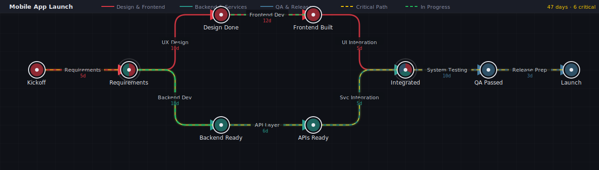

# TOC — Train of Consequences

**TOC** is a browser-based Critical Path Method (CPM) diagram editor. Build project networks from stations (milestones) and activities, and the CPM engine highlights the critical path in real time.



> *Example: Mobile App Launch — 9 stations, 3 lines, 47-day critical path through the backend branch.*  
> Load it yourself: **Load → `examples/mobile-app-launch.json`**

## Features

- Interactive SVG canvas — drag stations, click or drag to connect activities
- Multiple named path lines, each with its own colour
- Real-time CPM engine — forward/backward pass, float, critical path detection
- Critical path focus mode — click the stat counter to dim non-critical elements
- Mark activities as **in progress** — animated green overlay on the canvas
- Light / dark theme toggle
- Export diagram as **PNG** (2× resolution, clean background — ready for PowerPoint and email)
- Delete selected element with the **Del** key; **Esc** to deselect
- JSON save / load and automatic localStorage persistence
- Docker-ready production container

## Getting Started

Install dependencies:

```bash
npm install
```

Start the development server:

```bash
npm run dev
```

Open the app in your browser at the URL shown in the terminal.

## Build

Create a production build:

```bash
npm run build
```

## Docker

Build the Docker image:

```bash
docker build -t toc-editor .
```

Run the app in Docker:

```bash
docker run --rm -p 4173:4173 toc-editor
```

Open `http://localhost:4173` in your browser.

## Repository Structure

- `src/` — application source code
- `index.html` — Vite application entry
- `package.json` — project dependencies and scripts
- `vite.config.ts` — Vite configuration
- `.dockerignore` — Docker build ignore rules
- `Dockerfile` — container build instructions
- `README.md` — this file
- `CLAUDE.MD` — implementation notes and summary

## Notes

The primary application files are now located in the repository root, not inside a nested `Critical Path Diagram UI` folder.
  